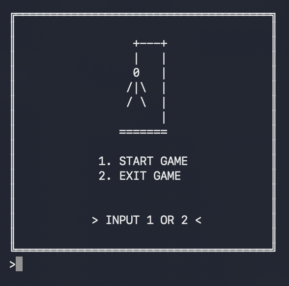
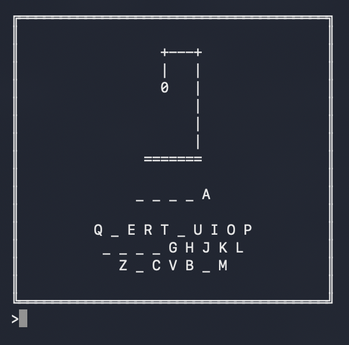

# Hangman

Консольная игра «Виселица» на Java с поддержкой русского и английского языков.  
В проекте отдельно вынесены интерфейс, игровая логика, правила, словари и текстовый GUI.

## Скриншоты

### Начало игры


### Игровой процесс


### Победа


## Запуск

Убедитесь, что у вас установлена Java.

```bash
  java src/com/busyrev/hangman/Main.java
```
## Как устроен проект

**Точка входа:**
- `src/com/busyrev/hangman/Main.java` — запуск приложения через `MenuImpl`

**Основная логика:**
- `src/menu/MenuImpl.java` — главное меню, выбор языка, запуск игры, завершение программы
- `src/game/GameImpl.java` — игровой цикл: выбор режима, выбор темы, отрисовка состояния, обработка хода игрока
- `src/man/ManImpl.java` — состояние игрока: выбранные буквы, ошибки, победа, поражение
- `src/judiciary/JudiciaryImpl.java` — загрузка словаря и правил, выбор слова, проверка букв, определение победы/поражения
- `src/executioner/HangmanImpl.java` — применение наказания за ошибку и завершение игры
- `src/display/DisplayImpl.java` — отрисовка интерфейса в консоли

## Как реализована логика игры

1. При запуске создаётся `MenuImpl`
2. Инициализируется `Scanner` с учётом ОС
3. Игрок выбирает язык
4. Загружается текстовый интерфейс из `GUI.txt`
5. Создаются основные игровые компоненты
6. Игрок выбирает режим и тему
7. Из словаря случайно выбирается слово
8. Запускается игровой цикл с проверкой букв, обновлением интерфейса и подсчётом ошибок
9. При полном открытии слова игрок побеждает
10. При превышении допустимого числа ошибок игрок проигрывает

## Где менять GUI

Текстовый интерфейс хранится в файлах:
- `src/resources/ENGLISH/GUI.txt`
- `src/resources/RUSSIAN/GUI.txt`

Отрисовка выполняется в:
- `src/display/DisplayImpl.java`

## Где менять правила игры

Правила хранятся в:
- `src/resources/ENGLISH/RULES.txt`
- `src/resources/RUSSIAN/RULES.txt`

Логика обработки правил реализована в:
- `src/judiciary/JudiciaryImpl.java`

## Где менять слова и темы

Словарь хранится в:
- `src/resources/ENGLISH/GLOSSARY.txt`
- `src/resources/RUSSIAN/GLOSSARY.txt`

Выбор слов реализован в:
- `src/judiciary/JudiciaryImpl.java`
